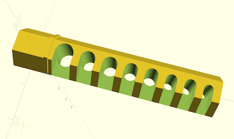

# Honeycomb Wall L-Key Insert

Parametric Allen and Torx key insert for the Honeycomb wall.

## Description

The model can be used to generate a hexagonal peg to insert in the honeycomb wall with a customizable number of custom sized cutouts to accomodate different size L-shaped allen and torx keys. The length of the suport is computed to accomodate all the keys specified.

The model offers the following customizable parameters:

| Name | Type | Description |
| :--- | :--- | :---------  |
| **hex_diameter** | float | diameter of the insert (the part that goes into the wall). This is configurable to account for variations in accuracy and also to allow using adapters like [Elegant Screwiverse Inserts for Honeycomb Storage Wall](https://www.printables.com/model/845539-elegant-screwiverse-inserts-for-honeycomb-storage) |
| **wall_insert_length** | float | Length of the wall insert |
| **support_diameter** | float | Diameter of the support part (the part that holds the screwdrivers). This allows to make the support part wider for bigger screwdrivers or narrower to save filament and print time |
| **key_type** | text | the type of key the support is for. Can be one of: Allen,Torx
| **key_measurements** | text | Comma separated list of float key dimensions. For allen keys the distance between two opposing faces, for torx the max diameter of the key. |
| **tolerance** | float | This is added to the size of each key slot to make putting/removing keys easier and to account for differences in print quality |
| **separator_width** | float | The witdh of the wall between key cutouts |
| **flip_support** | boolean | Controls the orientation of the cutout part to allow to create inserts either for right side or left side walls |

## Dependencies

[BOSL2](https://github.com/BelfrySCAD/BOSL2)

## Attribution

This model is inspired by [DST's model on printables](https://www.printables.com/model/461822-allen-key-pegs-and-nozzle-needle-for-honeycomb-sto)

## License

This model is licensed unde [Creative Commons (4.0 International License) Attribution](http://creativecommons.org/licenses/by/4.0/)