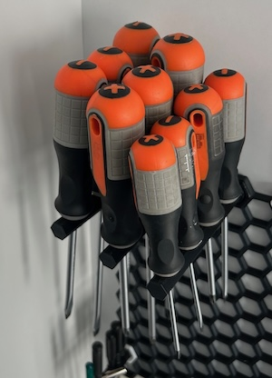
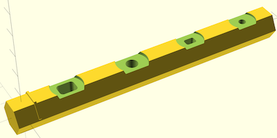
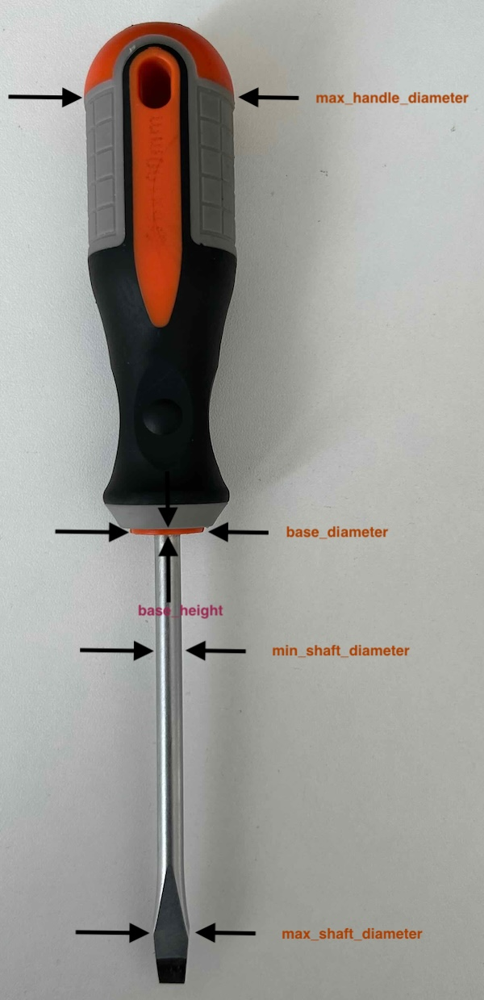

# Honeycomb Wall Screwdriver Insert

Parametric screwdriver insert for the Honeycomb wall.

## Description

I wanted a way of adding my various screwdrivers to a honeycomb wall for easy access but didn't find any model that fit all the different sizes so I created this parametric one.

The model can be used to generate a hexagonal peg to insert in the honeycomb wall with a customizable number of custom sized cutouts to accomodate different size screwdrivers. The length of the suport is computed to accomodate all the screwdrivers specified.

The model offers the following customizable parameters:

| Name | Type | Description |
| :--- | :--- | :---------  |
| **hex_diameter** | float | diameter of the insert (the part that goes into the wall). This is configurable to account for variations in accuracy and also to allow using adapters like [Elegant Screwiverse Inserts for Honeycomb Storage Wall](https://www.printables.com/model/845539-elegant-screwiverse-inserts-for-honeycomb-storage) |
| **wall_insert_length** | float | Length of the wall insert |
| **support_diameter** | float | Diameter of the support part (the part that holds the screwdrivers). This allows to make the support part wider for bigger screwdrivers or narrower to save filament and print time |
| screwdriver_measurements | text | This allows specifying and arbitrary number of screwdrivers measurements. This is basically a matrix of measurements but the openscad customizer doesn't allow editing matrices so this string is parsed into one. Screwdriver slots are separated with \| characters. Each slot needs to specify a comma separated list of float values for the following measurements: min_shaft_diameter,max_shaft_diameter,base_diameter,base_height,max_handle_diameter. No spaces or other characters should be present in the string |

The following measurements need to be taken for each screwdriver slot:

 - **min_shaft_diameter** - The minimum diameter of a circle that the screwdriver shaft can pass through. Measure the thickest part of the shaft (not the head for straight screwdrivers) 
 - **max_shaft_diameter** - The maximum diameter of the shaft. This allows for creating a wider section for the head of flat screwdrivers to pass through without widening the entire slot
 - **base_diameter** - The diameter at the base of the screwdriver (where the shadt begins). This is used for creating a hollow for the handle to sink into for more stability. 
 - **base_height** - The height of the cutout for the handle base
 - **max_handle_diameter** - The maximum diametee of the screwdriver handle. This is used to compute the spacing between screwdrivers and the length of the support

## License

This model is licensed unde [Creative Commons (4.0 International License) Attribution](http://creativecommons.org/licenses/by/4.0/)