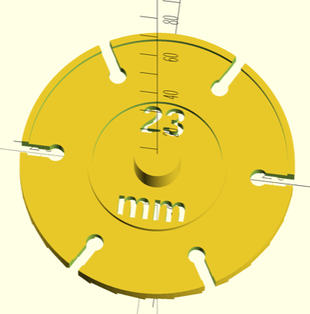
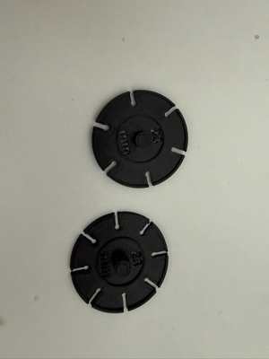
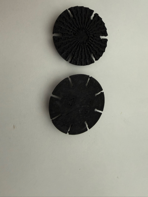
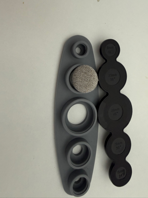

# Button Fabric Marking Template

Parametric customizable fabric marking template for covering buttons

## Description

This model generates a circular template used for cutting fabric to cover buttons. Place the template on the fabric, hold it steady using the center post, and trace around the outer edge (including notches) with a pen or marker, then cut. The notches guide where to snip inward so the fabric folds neatly around the button shell.

The template features a base disk with an optional raised rim, cut-guide notches around the perimeter, an inner guide ring showing the button diameter, engraved size labels, a center post for stability, and an optional sawtooth grip pattern on the underside for better handling.

The model offers the following customizable parameters:

| Name | Type | Description |
| :--- | :--- | :--------- |
| **button_diameter** | float | button diameter in mm (10-60) |
| **fold_margin** | float | folding margin per side in mm |
| **num_notches** | int | number of cut-guide notches (0 = none, up to 32) |
| **notch_depth** | float | depth of each notch in mm |
| **notch_width** | float | width of each notch in mm |
| **notch_mark_diameter** | float | pencil mark circle diameter at inner end of notch |
| **rim_height** | float | rim height in mm (0 = no rim) |
| **rim_width** | float | rim width in mm |
| **guide_ring_height** | float | inner guide ring height in mm (0 = no ring) |
| **guide_ring_width** | float | inner guide ring width in mm |
| **center_post_height** | float | center post height in mm (0 = no post) |
| **center_post_radius** | float | center post radius in mm |
| **text_size** | float | engraved text size in mm |
| **text_depth** | float | engraving depth in mm |
| **material_grip** | boolean | enable sawtooth grip pattern on the base underside |
| **sawtooth_spacing** | float | ring spacing for grip pattern in mm |
| **sawtooth_height** | float | tooth height for grip pattern in mm |
| **tooth_angle** | float | tooth angular span in degrees |
| **tooth_gap** | float | gap between teeth in degrees |
| **base_thickness** | float | base thickness in mm |

## License

This model is licensed unde [Creative Commons (4.0 International License) Attribution](http://creativecommons.org/licenses/by/4.0/)
