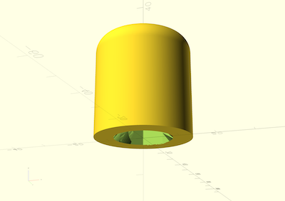

# Dumbell Disc Support

Parametric customizable support rod for dumbell discs (and other objects)

## Description

This model was created because I needed a way to store my corength dumbell discss. It allows generating supports with a variable diameter and height disc base and a center rod that can be either be part of the base or printed in threaded sections that can be combined to increase the center rod height as needed. Initially this was created as a support for dumbell discs but it can be used for other stuff (paper towels, cds ...).

The model offers the following customizable parameters:

| Name | Type | Description |
| :--- | :--- | :---------  |
| **type** | text | object type to generate, Either a base or an extesion rod. The extension rods have internal threads on the bottom. Possible values: base. rod |
| **top_cap** | boolean | if true this will generate a cap instead of the threaded rod. This can be used both on a rod to generate a cap or directly on a base if a fixed height support is required |
| **support_base_diameter** | float | diameter of the support base |
| **key_typesupport_base_height** | float | height of the base (without the holder rod directly on the base) |
| **support_rod_diameter** | float | diameter of the support rod |
| **support_height** | float | height of the supporting rod of the section (excluding base height and the height of the thread at the top if the section is not a top cap) |
| **thread_diameter** | float | diameter of the threaded section |
| **thread_height** | float | height of the threaded section |
| **thread_starts** | int | number of thread starts. Higher number makes the sections quicker to add/remove but less resistant to vertical tension. |
| **pitch** | float | length between threads |
| **clearance** | float | clearance value to be applied to the interior threads. This is applied to the $slop parameter of the BOSL2 [threaded_rod module](https://github.com/BelfrySCAD/BOSL2/wiki/threading.scad#module-threaded_rod)  |

## Dependencies

[BOSL2](https://github.com/BelfrySCAD/BOSL2)

## License

This model is licensed unde [Creative Commons (4.0 International License) Attribution](http://creativecommons.org/licenses/by/4.0/)