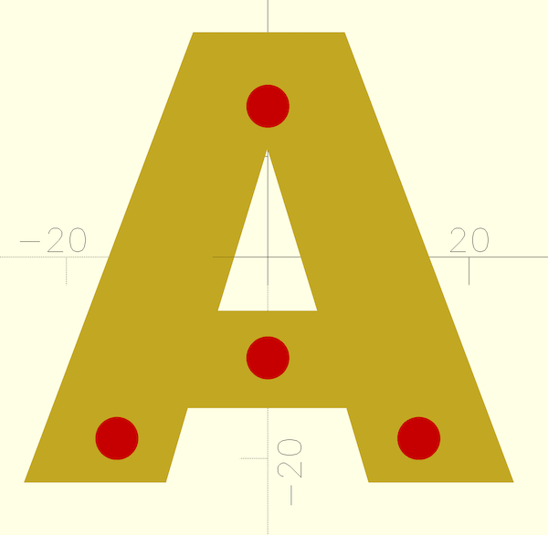
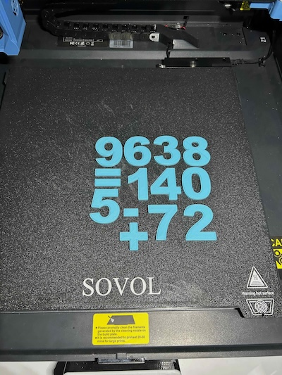
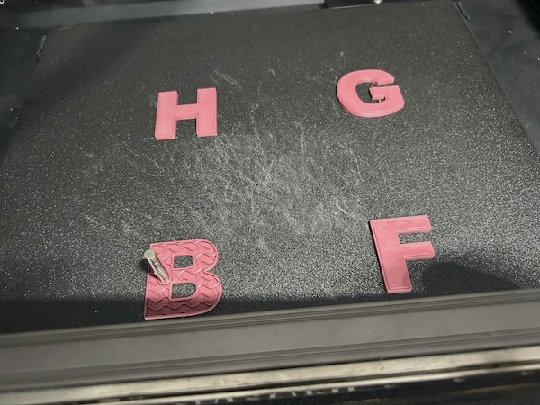
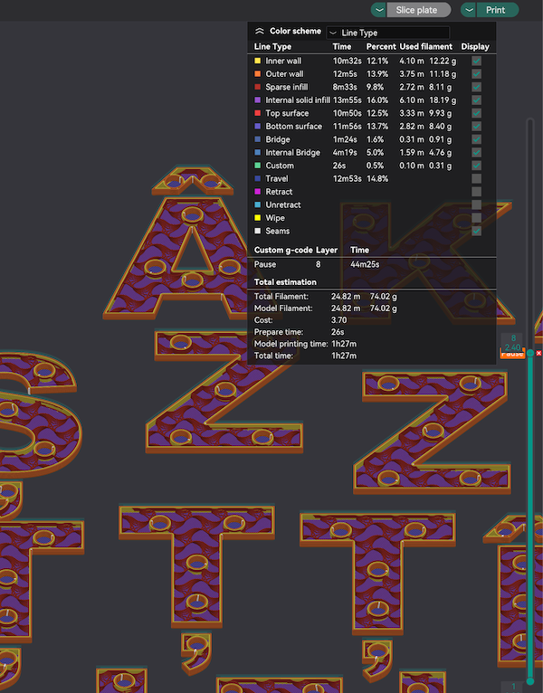

# Magnetic Letters

Parametric customizable magnetic letters

## Description

Model that allows generating letters with spaces for embeding round magnets. Up to 10 magnets can be added to the letter. The magnet size and positions are configurable. The magnet holes are positioned inside the letter so the print needs to be paused in order to insert the magnets.

The model offers the following customizable parameters:

| Name | Type | Description |
| :--- | :--- | :---------  |
| **character** | text | The character to genearate |
| **preview** | boolean | This moves the magnet holes to the top of the letter so positioning can be easier. Disable before final generation. |
| **bottom_height** | float | Solid space on the letter bottom before the magnet holes start. Usually the height of a layer is enough. |
| **clearance** | float | Clearance used for the magnet holes (both the diameter and the height) |
| **magnet_diameter** | float | Diameter of the magnet |
| **magnet_height** | float | Height of the magnet |
| **font** | text | Font to use. See the font list window for possible values |
| **text_size** | float | Size of the text |
| **letter_height** | float | Thickness of the letter |
| **top_contour** | boolean | trim a contour at the top so it's distinguishable from the bottom part with the magnet |
| **contour_height** | float | height of the top contour  |
| **contour_width** | float | width of the top contour  |
| **magnetX_enabled** | boolean | enable magnet number X (X can be 1-10)  |
| **magnetX_pos** | array | array with the x and y positions on magnet number X (X can be 1-10) |

## License

This model is licensed unde [Creative Commons (4.0 International License) Attribution](http://creativecommons.org/licenses/by/4.0/)