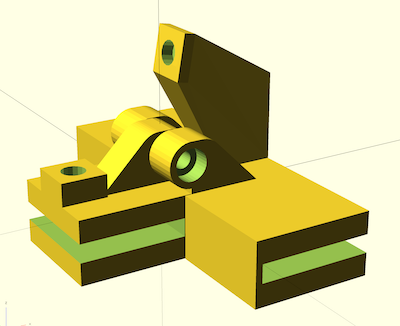

# Sovol SV08 Top panel magnetic hinges

Parametric magnetic hinges for the top panel of SV08

## Description

These hinges were created to be able to open the top of the Sovol SV08 3D printer's original enclosure while printing PLA and other materials that need more cooling. 
The supports fit in the 2 mm gap between the 2 glass pannels. At least 2 hinges should be used.
The mobile panel opens about 100˚ and can be secured with magnets inserted in cutouts in the support.

This also provides a cover for the gaps between the hinges for a better closure.

The model offers the following customizable parameters:

| Name | Type | Description |
| :--- | :--- | :---------  |
| **generate** | text | View to generate. Can be one of: outter hinge, inner hinge, assembled down, assembled up |
| **wall_width** | float | width of the walls surrounging the glass |
| **glass_width** | float | width of the glass (allows increasing clearance) |
| **support_length** | float | length of the support. If this is modified manual adjustments of the outerhinge magnet support arm will be needed |
| **support_width** | float | width of the support. The interior hinge will be equal to this (- 2 X tolerance ) while the outer hinge will be 3 x width |
| **pannel_gap** | float | gap between the fix and the mobile panel |
| **tolerance** | float | Tolerance for various parts |
| **knuckle_diam** | float | diameter of the hinge knuckle |
| **knuckle_offset** | float | Knuckle offset |
| **arm_height** | float | Knuckle arm height |
| **pin_diameter** | float | diameter of the socket hole |
| **screw_head_type** | float | Screw head type for the counterbore hole |
| **screw_head_depth** | float | Depth of the screw head hole |
| **nut_type** | float | Type of the nut insert |
| **nut_depth** | float | Depth of the nut insert |
| **magnet_diam** | float | Magnet diameter |
| **magnet_height** | float | Magnet height |
| **cover_length** | float | length of the cover for the gaps between hinges |
| **cover_width** | float | width of the cover for the gaps between hinges |
| **cover_low_section_length** | float | length of the cover section under the glass (for a better closure) |

## Required hardware

Each hinge needs a screw and nut and 2 magnets. 

The default configuration uses the following:
 - M3x16 screw
 - M3 nut
 - 2 4x3 magnets 

## Dependencies

[BOSL2](https://github.com/BelfrySCAD/BOSL2)

## License

This model is licensed unde [Creative Commons (4.0 International License) Attribution](http://creativecommons.org/licenses/by/4.0/)